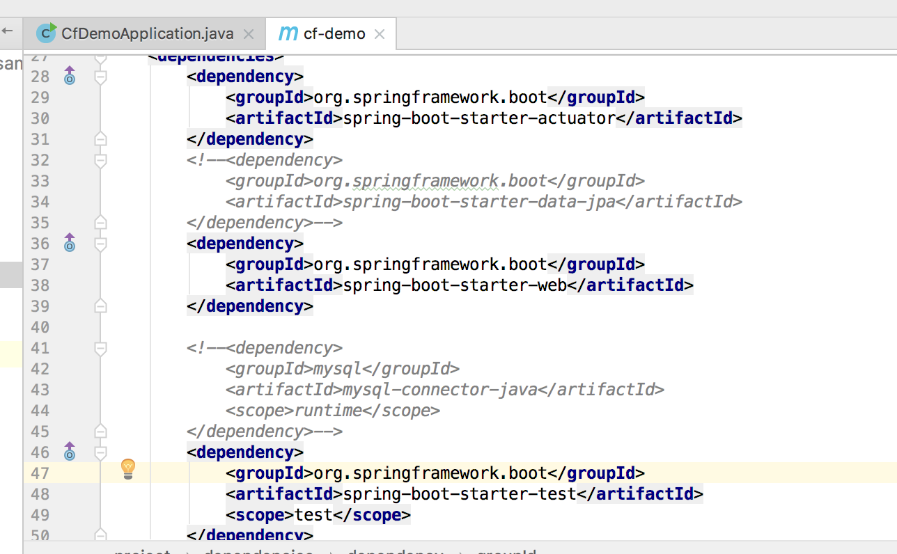
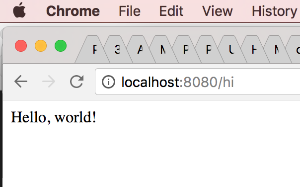
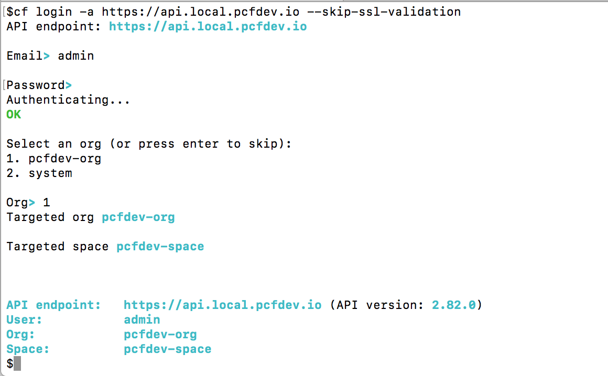
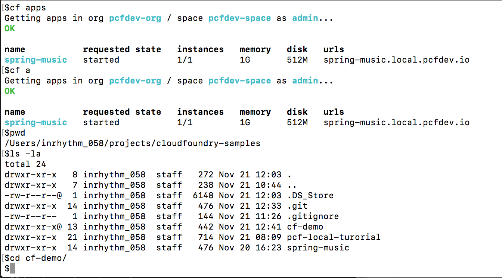

# Basic CF App
-

- Some local configurations:

**~/.profile file**:

~~~bash
export PS1="$"
alias idea="open -a /Applications/IntelliJ\ IDEA\ CE.app"
alias ll='ls -lG'
~~~


Need to uncomment JPA-related things in pom.xml to prevent errors:


- Build it: 
	`$./mvnw clean package`


- Now we can run: `ctrl+shift+r` -->  run in IntelliJ



- Start a local PCF env: 



- To list known apps: `cf apps` or `cf a`:



```
$du -hs cf-demo-0.0.1-SNAPSHOT.jar
 14M	cf-demo-0.0.1-SNAPSHOT.jar
$pwd
/Users/sl/projects/cloudfoundry-samples/cf-demo/target
$
```
- Push the app:

```cf push -p cf-demo-0.0.1-SNAPSHOT.jar cf-demo```

```
dk_jre/bin/killjava.sh $CALCULATED_MEMORY -Djavax.net.ssl.trustStore=$PWD/.java-buildpack/container_certificate_trust_store/truststore.jks -Djavax.net.ssl.trustStorePassword=java-buildpack-trust-store-password" && SERVER_PORT=$PORT eval exec $PWD/.java-buildpack/open_jdk_jre/bin/java $JAVA_OPTS -cp $PWD/. org.springframework.boot.loader.JarLauncher`

Showing health and status for app cf-demo in org pcfdev-org / space pcfdev-space as admin...
OK

requested state: started
instances: 1/1
usage: 256M x 1 instances
urls: cf-demo.local.pcfdev.io
last uploaded: Tue Nov 21 18:01:45 UTC 2017
stack: cflinuxfs2
buildpack: container-certificate-trust-store=2.0.0_RELEASE java-buildpack=v3.13-offline-https://github.com/cloudfoundry/java-buildpack.git#03b493f java-main open-jdk-like-jre=1.8.0_121 open-jdk-like-memory-calculator=2.0.2_RELEASE spring-auto-reconfiguration=1.10...

     state     since                    cpu    memory          disk             details
#0   running   2017-11-21 01:03:53 PM   0.0%   79.7M of 256M   136.9M of 512M
$cf a
Getting apps in org pcfdev-org / space pcfdev-space as admin...
OK

name           requested state   instances   memory   disk   urls
spring-music   started           1/1         1G       512M   spring-music.local.pcfdev.io
cf-demo        started           1/1         256M     512M   cf-demo.local.pcfdev.io
$
```
- Making sure it's running:

```
$curl cf-demo.local.pcfdev.io/hi
Hello, world!
$
```