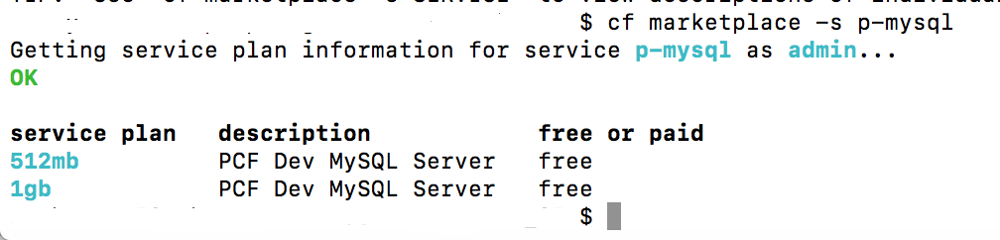
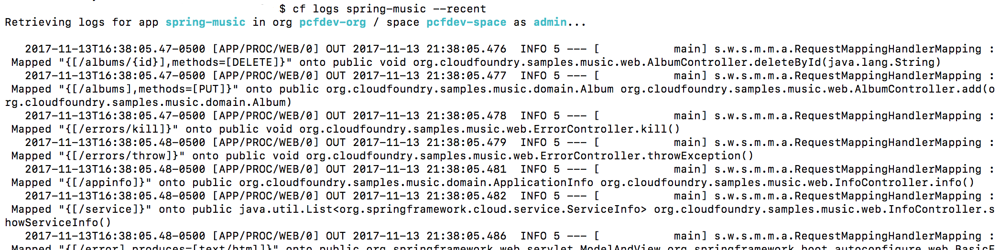

PCF Dev - a small footprint distribution intended to be run locally on a developer machine actively building cloud-native PCF.  It offers accelerated development cycles enabled by consistent, structured build and operational visibility unlocked through integrated logging, metrics and health monitoring and management.

Prior to running PCF Dev, one needs the following installed:

* JDK 7+

* VirtualBox 5+

We are going to be communicating with PCF Dev via the command line, hence we need to download the CLI from [here](https://cli.run.pivotal.io/stable?release=macosx64&source=github).

Installation was successful:

Now download PCF image from [here](https://network.pivotal.io/products/pcfdev).

Unzip the downloaded file: 

    $ unzip pcfdev-VERSION-osx.zip

And install the PCF Dev plugin:

    $ ./pcfdev-VERSION-osx

We are ready to start using it:

Let’s deploy a sample app:

    $ git clone [https://github.com/cloudfoundry-samples/spring-music](https://github.com/cloudfoundry-samples/spring-music)

    $ cd spring-music

Assemble the app locally with Gradle:

    $ ./gradlew assemble

We are ready to deploy the app:

    $ cf push --hostname spring-music

The app was given a route: **spring-music.local.pcfdev.io**

Let’s access it: 

* Via command line:

* Or via browser:

Since we haven’t bound an instance of DB service, our sample app uses an in-memory DB by default:

Let’s configure it to run an out-of-process MySQLl DB:

Let’s see what services we have available:

Let’s see the available MySQL offerings:

We have 2 plans, both are free.  Let’s use the 512mb one:

    $ cf create-service p-mysql 512mb my-spring-db

And bind it to our application:

Once a service is bound to an app, environment variables are stored that allow the app to connect to the service after a push, restage, or restart command.

We need to restart to make changes effective:

We can observe the change now:

PCF lets us scale the app up and down:

We can also scale the app vertically, both for memory and disk:

    $ cf scale spring-music -m 1G

    $ cf scale spring-music -k 512M

PCF provides great visibility into the running applications through a component called Loggregator which multiplexes the logs from multiple instances of various applications running on different nodes of a cluster  into a single log stream that we can then tail if necessary.

* View recent application log:

        $ cf logs spring-music --recent

* Live log streaming:

        $ cf logs spring-music 

Every container host (which is a Diego cell) runs a component called a Matreon which is a local staging point for the logs being streamed out of all of the individual containers.  The logs are also being aggregated from the system components, so the routers, the load balancers, the cloud controller, various registries will also go to these Matreon feeder systems and over various protocols are aggregated and tailed out to nozzles.  A nozzle is an arbitrary endpoint, so the architecture of the Loggregator is that we have a lot of different log sources and a lot of different log sinks and in between we have a set of different filters.  We might say, all of the logs related to this org or to this space, or this collection of applications should be picked up by this nozzle, but not these other ones, or they should be filtered in some interesting way.  Typically we see this, for example, developers want to concentrate on their dev environment whereas operations team care a lot about production.  So an app can be deployed in several different spaces but production environment have additional logging and monitoring tools attached to those nozzles because they may want to do further inspection of those logs as they are going to archive them, analyze them, etc.  

Logging itself is a structured data format with an underlying schema and an existing RFC for it and PCF conforms with it so that all the collected logs are analyzable via tools like Splunk, ElasticSearch and Kibana, Papertrail, Sumo Logic, AppDynamics, Dynatrace, New Relic, etc. which can drill into columns of data they can perceive in an output.  And common logging libraries today, like Logstash library for Java, will support objects in the output, so one can actually design records.  

The infrastructure inside CloudFoundry [deals with both logs and metrics](https://docs.pivotal.io/tiledev/nozzle.html), where metric is something having a counter (e.g. number of requests per sec, the amount of CPU used, the amount of RAM being consumed by a given app instance).  Logs and metrics are related but they constitute two entirely distinct sets of data.  And Pivotal’s CloudFoundry distribution infrastructure (in its Apps Manager) provides support for dealing with both classes of data, i.e. correlating both logs and metrics by time, etc.

And all of the 3rd party partners mentioned above built their tooling using loggregators, nozzles and filters and other ways of interacting with PCF to consume those logs and metrics and present them in a way that makes sense to their audience (either operators of the apps, operators of the platform, or the developers or some mixture of those different roles).  Not reinventing the wheel and instead letting those purpose-built tool do the work for you by hooking them into PCF-provided connectors is another benefit that PCF brings.  

For example, we can create a Papertrail-based user provided log drain as a service:

    $ cf cups papertrail-logs -l syslog-tls://logs.papertrailapp.com:49046

which then can be bound to any application(s)

APM (Application Performance Manager):
[ more content ]

We are done.  PCF VM can be safely stopped now:

    $ cf dev stop

Latest PCF docs are located [here](https://docs.pivotal.io/pivotalcf/1-12/concepts/)

One can also push Docker images via Cloud Foundry CLI to be deployed as apps/services on the platform.   The process is documented [here](https://docs.pivotal.io/pivotalcf/1-12/devguide/deploy-apps/push-docker.html).

